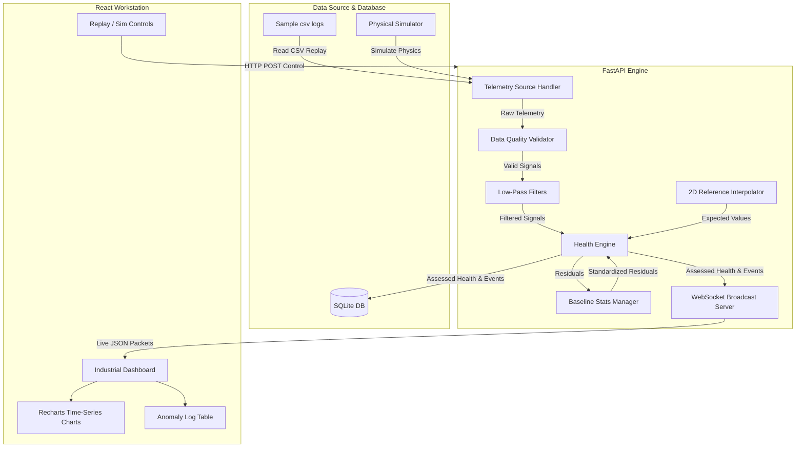

# THRUST-HM System Architecture

This document describes the software architecture and data pipelines for **THRUST-HM V1**.

---

## 1. Component Block Diagram

---

## 2. Telemetry Ingestion Pipeline

1.  **Ingestion Interval**: Telemetry runs inside a background loop at **10 Hz** (defined in `config/system.yaml`).
2.  **TelemetrySource**: Abstract interface handles data retrieval.
    *   `CSVReplaySource`: Paces lines from a CSV log using timestamps.
    *   `SimulationTelemetrySource`: Updates synthetic physical states and applies active fault injection (friction, dropouts, thermal runaways, sag).
3.  **Data Quality Validation**: Check for dropouts, NaNs, sensor bounds, and stuck telemetry. Degraded samples are discarded, triggering info events to prevent model corruption.
4.  **Signal Filtering**: Filters raw noise on current and temperature using first-order low-pass (exponential) digital filters.
5.  **Reference Model Comparison**: Queries the 2D calibration grid via SciPy's bilinear/RegularGrid interpolator using filtered PWM and Voltage to compute expected values.
6.  **Anomaly Detection**: Evaluates running statistics, EWMA, and CUSUM deviations.
7.  **Database Storage**: Inserts raw/processed telemetry and triggered event alerts into SQLite.
8.  **WebSocket Broadcast**: Emits a combined JSON payload of telemetry, alerts, and replay status to all active client dashboards.
