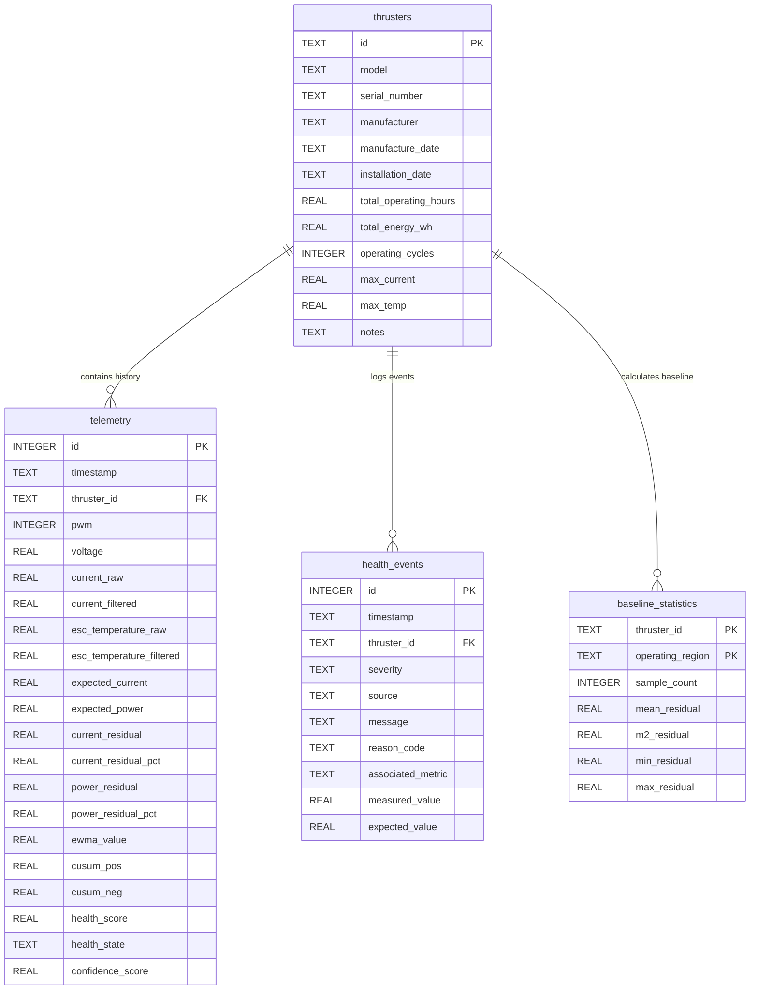

# THRUST-HM Database Schema

This document details the SQLite database design and tables for **THRUST-HM V1**.

---

## 1. Schema Diagram

---

## 2. Table Fields Reference

### 2.1 Table: `thrusters`
Stores metadata and accumulated lifetime characteristics of the thrusters.
*   `id`: Primary key (e.g. `"T200-001"`).
*   `total_operating_hours`: Total runtime hours accumulated while thruster is in an active operating state.
*   `total_energy_wh`: Integrated electric energy consumed over time (\(\int V \cdot I \cdot dt\) in Watt-hours).
*   `operating_cycles`: Count of transitions from a neutral state to an active state.

### 2.2 Table: `telemetry`
Primary time-series data table containing raw inputs and calculations.
*   Indexed by `timestamp` and `thruster_id` to guarantee fast retrieval for plotting.

### 2.3 Table: `health_events`
Stores warning logs, limits violations, sensor dropouts, and diagnostic status flags.
*   `severity`: `INFO`, `WARNING`, `CRITICAL`.
*   `source`: `DATA_QUALITY`, `ELECTRICAL`, `THERMAL`, `STABILITY`.

### 2.4 Table: `baseline_statistics`
Stores running statistical accumulators for Z-score checks across regions (NEUTRAL, LOW_PWM, FORWARD, REVERSE).
*   Uses Welford's algorithm variables (`mean_residual`, `m2_residual` sum of squares) to enable incremental updates.
