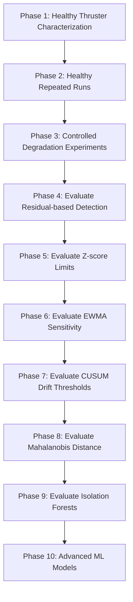

# THRUST-HM Controlled Experimentation Guide

This document describes the future experimental workflows recommended to transition THRUST-HM from anomaly detection to fault classification.

---

## 1. Experimental Workflow Stages

### Phase 1: Healthy Characterization
Establish the baseline operating envelope using a new, clean thruster under controlled tank conditions across a sweep of voltages (10V-20V) and PWM steps (1100-1900µs).

### Phase 2: Healthy Repeated Runs
Run the healthy thruster repeatedly to record normal variance, sensor noise, and thermal heat profiles. This defines standard deviations for each region.

### Phase 3: Controlled Degradation
Inject physical faults under controlled laboratory setups:
*   **Friction**: Install drag elements or tighten shaft seals.
*   **Fouling**: Wrap synthetic kelp/monofilament lines around the propeller shaft.
*   **Propeller Damage**: Use blades with minor chips, nicks, or cracks.
*   **ESC Degradation**: Apply external thermal loads.

### Phase 4-7: Statistical Evaluations
Run the recorded datasets through the health engine. Adjust configuration parameters (`lambda` for EWMA, `k` and `h` for CUSUM) to optimize the trade-off between **detection delay** and **false alarm rate**.

### Phase 8-10: Multivariate & Machine Learning
*   Train Mahalanobis distance models on healthy feature vectors to combine current residuals and temperature rates.
*   Train Isolation Forest or One-Class SVM models to detect multivariate outliers.
*   Incorporate supervised ML only if sufficient failure run-to-destruction data has been gathered to prevent overfitting.
